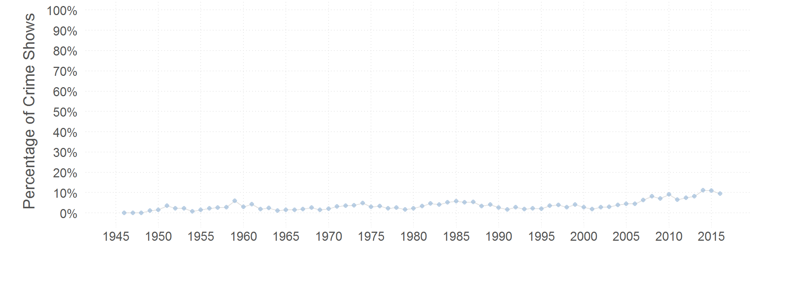
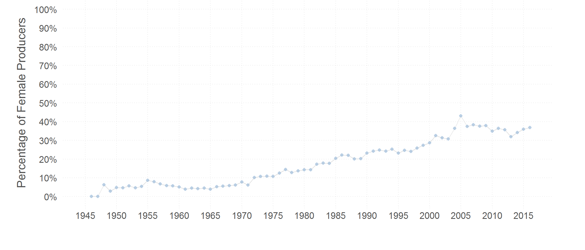

## What and Who is on Network Television?

Using data on TV schedules and metadata on TV programs from Wikipedia, we explore the popularity of different genres of shows over time, and the race and gender composition of directors, producers, creators, presenters, cast members, music composers, etc. 

A small preview of what we find: 

The percentage of shows that are on crime has gone from 0 to about 10% over the last 70 years. 

The percentage of black cast members, presenters, directors, and producers has remained less than 5%, scraping 0 some years. Trends for gender are slightly more hopeful. The percentage of female cast members has risen from around 30% to about 40% in recent years. The percentage of female directors has risen at a steady clip from 0 to about 10%, while the most pleasing trend has been among female producers, which has risen from 0 to about 35%.

The rest of the document is arranged as follows:

1. [Scripts](#scripts) --- how did we get the data and run the analyses
2. [Data](#data) --- final data used for the analyses
3. [Results](#results) --- tables and figures

-----------------------------

### Scripts

For running the Python scripts at your end, see the [readme](scripts/README.md)

1. **Get the data**
    - [Get TV Schedules](scripts/tv_schedules.py)
    - [Get Meta Data for TV Programs](scripts/tv_schedules_meta.py)

2. **Parse and Augment the data**
    - [Parse Names and Roles Data And Add Race and Gender via Python](scripts/names_role.py)
    - [Impute Race and Gender using R](scripts/gender_race.R)

3. **Analyze the data**
    - [Race and Gender of Different Roles Over Time](scripts/race_gender_over_time.py)
    - [Pretty Graphs](scripts/figs.R)

### Data

Data are from [TV Schedules Data on Wikipedia](https://en.wikipedia.org/wiki/Category:United_States_television_schedules) and gray boxes (informational boxes on the right-hand side of Wikipedia pages of TV programs)

* [US TV Schedules](data/us_tv_schedules.csv)
    - **fields:** no (id), year (years show was on the air), period (prime time, daytime), day (day of the week), season (Fall, Winter, ...), channel (channel name), channel_optional (misc.), program (program name), begin (start time), end (end time)

* [US TV Schedules plus info. from the gray box of the program](data/us_tv_schedules_meta.csv)
    - **additional fields:** meta_link (link), genre (Crime, Game show, etc.), running_time, meta (JSON of all the meta fields), audio_format, picture_format, created_by, directed_by, starring, presented_by, executive_producers, producers, composers

* [(Augmented) Names of people on TV with crosswalk to TV schedules](data/us_tv_schedules_names.csv)
    - name (name of the person), field (role on the tv program), index (index number in [data/us_tv_schedules_meta.csv](data/us_tv_schedules_meta.csv), gender, race (imputed via Python demographics package, and R packages gender, and ethnicolor)

* [Further Augmented Names File with Imputations of Race and Gender from R](data/tv_names_race_gender.csv)

### Results

* Tables
    - Gender and Race of Producers, Presenters, etc. over time 
        - [Python pkg. imputation](data/us_tv_schedules_prop.csv) 
        - [R packages imputation + Python imputation](data/us_tv_schedules_prop_R.csv) 
            + year, prop1_female_producers (proportion of shows with at least one female producer = total number of shows with at least one female producer/total number of shows), prop1_female_directors (proportion of shows with at least one female director), prop1_female_creators (proportion of shows with at least one female creator), prop_female_producers (total number of female producers divided by the total number of producers), prop_female_directors (total number of female directors divided by the total number of directors), prop_female_creators (total number of female creators divided by the total number of creators), prop_female_cast (total number of female cast members/total number of cast members), prop_female_presenters (total number of female presenters divided by the total number of presenters),  prop1_black_producers, ...

* A Few Graphs:
    - [Percentage of Crime Shows Over time](figs/crime_over_time.pdf)
    - [Percentage of Black Producers over time](figs/black_producers_over_time.pdf)
    - [Percentage of Female Producers over time](figs/female_producers_over_time.pdf)
    - [Percentage of Black Presenters over time](figs/black_presenters_over_time.pdf)
    - [Percentage of Female Presenters over time](figs/female_presenters_over_time.pdf)
    - [Percentage of Black Directors over time](figs/black_directors_over_time.pdf)
    - [Percentage of Female Directors over time](figs/female_directors_over_time.pdf)
    - [Percentage of Black Cast Members over time](figs/black_cast_members_over_time.pdf)
    - [Percentage of Female Cast Members over time](figs/female_cast_members_over_time.pdf)

### Authors

Gaurav Sood and Suriyan Laohaprapanon

### License

Released under [CC BY 2.0](https://creativecommons.org/licenses/by/2.0/). 

### Contributor Code of Conduct

The project welcomes contributions from everyone! In fact, it depends on it. To maintain this welcoming atmosphere, and to collaborate in a fun and productive way, we expect contributors to the project to abide by the [Contributor Code of Conduct](http://contributor-covenant.org/version/1/0/0/).

